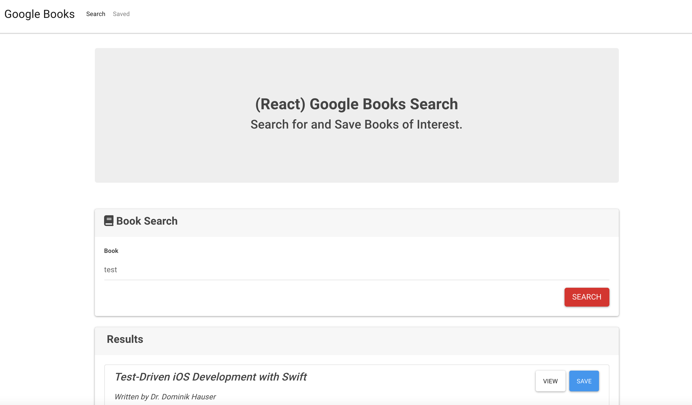
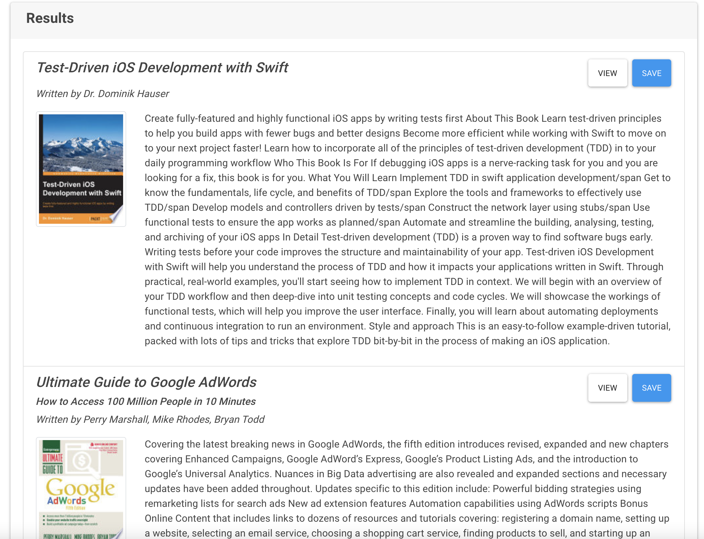
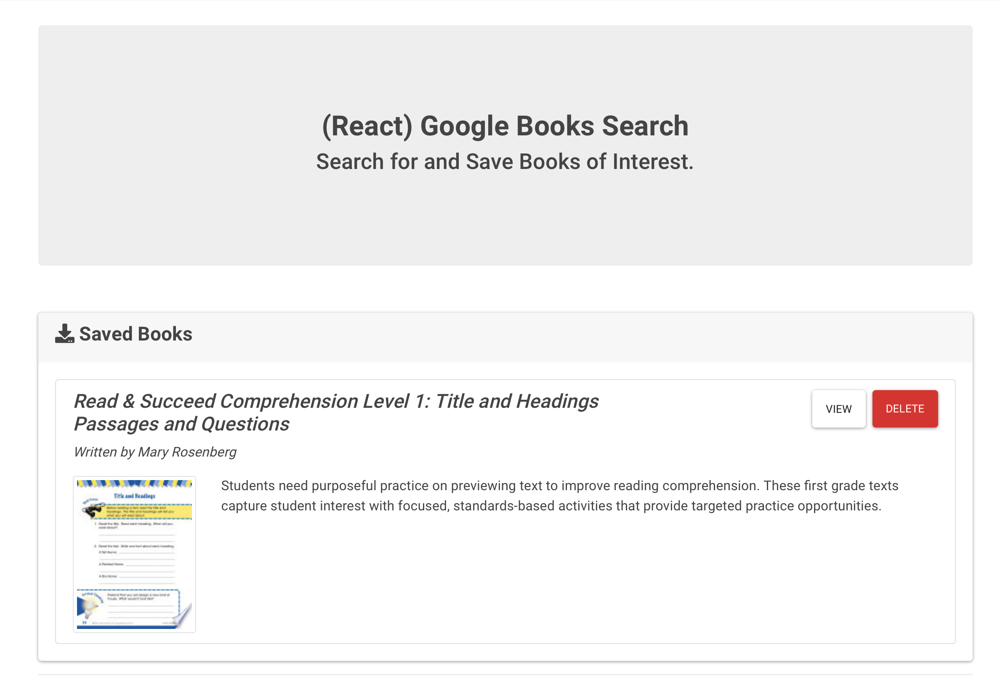

# Google Books Search Application

URL of the deployed application: https://googlebookssearchipan.herokuapp.com/saved

URL of the GitHub repository: https://github.com/iPan7/googlebooksreactsearchhw

## Table of Contents 

* [Description](#description)
* [View](#view)
* [Screenshots](#screenshots)
* [Built With](#built-with)
* [License](#license)

## Description

This React-based Google Books Search application queries and display books based on user searches. This application was also built with React, Node, Express and MongoDB so that users can save books to review or purchase later.

## View

To view the website, you can click [here](https://googlebookssearchipan.herokuapp.com/saved).

## Screenshots

The user can search for books via the Google Books API and render them under the Search tab. The user has the option to view a book by clicking on the book's title, bringing them to the book on Google Books, or "Save" a book, saving it to the Mongo database.

The Saved page renders all books saved to the Mongo database. Again, the user has the option to view a book by clicking on the book's title, bringing them to the book on Google Books, or "Delete" a book, removing it from the Mongo database.

## Built With

* [Express](https://expressjs.com/) - A Node.js web application server framework used to build web applications. 
* [Google Books API](https://developers.google.com/books) - An API that allows applications to retrieve book information from Google Books.
* [MongoDB](https://www.mongodb.com/) - A popular NoSQL database management program.
* [React.js](https://reactjs.org/) - A JavaScript Library used for building user interfaces. 

## License

Copyright 2020 Ian Panlilio

Licensed under the [MIT License](https://opensource.org/licenses/MIT)